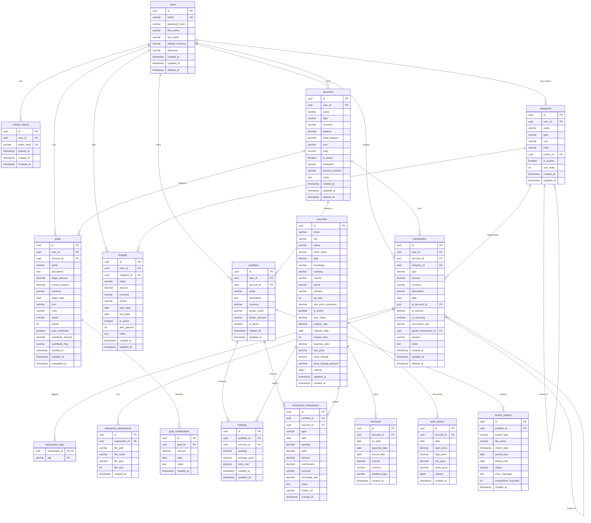
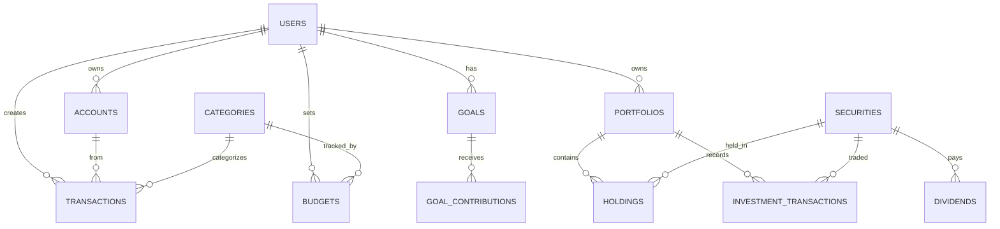
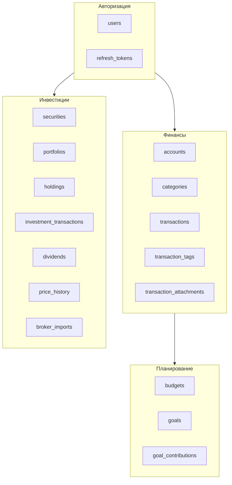

# ER Диаграмма FinTracker

## Полная диаграмма

```mermaid
erDiagram
    %% ===== ПОЛЬЗОВАТЕЛИ И АВТОРИЗАЦИЯ =====
    users {
        uuid id PK
        varchar email UK
        varchar password_hash
        varchar first_name
        varchar last_name
        varchar default_currency
        varchar timezone
        timestamp created_at
        timestamp updated_at
        timestamp deleted_at
    }

    refresh_tokens {
        uuid id PK
        uuid user_id FK
        varchar token_hash UK
        timestamp expires_at
        timestamp created_at
        timestamp revoked_at
    }

    %% ===== ФИНАНСЫ =====
    accounts {
        uuid id PK
        uuid user_id FK
        varchar name
        varchar type
        varchar currency
        decimal balance
        decimal initial_balance
        varchar icon
        varchar color
        boolean is_active
        varchar institution
        varchar account_number
        text notes
        timestamp created_at
        timestamp updated_at
        timestamp deleted_at
    }

    categories {
        uuid id PK
        uuid user_id FK
        varchar name
        varchar type
        varchar icon
        varchar color
        uuid parent_id FK
        boolean is_system
        int sort_order
        timestamp created_at
        timestamp updated_at
    }

    transactions {
        uuid id PK
        uuid user_id FK
        uuid account_id FK
        uuid category_id FK
        varchar type
        decimal amount
        varchar currency
        varchar description
        date date
        uuid to_account_id FK
        decimal to_amount
        boolean is_recurring
        varchar recurrence_rule
        uuid parent_transaction_id FK
        varchar location
        text notes
        timestamp created_at
        timestamp updated_at
        timestamp deleted_at
    }

    transaction_tags {
        uuid transaction_id PK,FK
        varchar tag PK
    }

    transaction_attachments {
        uuid id PK
        uuid transaction_id FK
        varchar file_path
        varchar file_name
        varchar file_type
        int file_size
        timestamp created_at
    }

    %% ===== БЮДЖЕТЫ И ЦЕЛИ =====
    budgets {
        uuid id PK
        uuid user_id FK
        uuid category_id FK
        varchar name
        decimal amount
        varchar currency
        varchar period
        date start_date
        date end_date
        boolean is_active
        int alert_percent
        text notes
        timestamp created_at
        timestamp updated_at
    }

    goals {
        uuid id PK
        uuid user_id FK
        uuid account_id FK
        varchar name
        text description
        decimal target_amount
        decimal current_amount
        varchar currency
        date target_date
        varchar icon
        varchar color
        varchar status
        int priority
        boolean auto_contribute
        decimal contribute_amount
        varchar contribute_freq
        timestamp created_at
        timestamp updated_at
        timestamp completed_at
    }

    goal_contributions {
        uuid id PK
        uuid goal_id FK
        decimal amount
        date date
        text notes
        timestamp created_at
    }

    %% ===== ИНВЕСТИЦИИ =====
    securities {
        uuid id PK
        varchar ticker
        varchar isin
        varchar name
        varchar short_name
        varchar type
        varchar exchange
        varchar currency
        varchar country
        varchar sector
        varchar industry
        int lot_size
        decimal min_price_increment
        boolean is_active
        decimal face_value
        decimal coupon_rate
        date maturity_date
        int coupon_freq
        decimal expense_ratio
        decimal last_price
        decimal price_change
        decimal price_change_percent
        bigint volume
        timestamp updated_at
        timestamp created_at
    }

    portfolios {
        uuid id PK
        uuid user_id FK
        uuid account_id FK
        varchar name
        text description
        varchar currency
        varchar broker_name
        varchar broker_account
        boolean is_active
        timestamp created_at
        timestamp updated_at
    }

    holdings {
        uuid id PK
        uuid portfolio_id FK
        uuid security_id FK
        decimal quantity
        decimal average_price
        decimal total_cost
        timestamp created_at
        timestamp updated_at
    }

    investment_transactions {
        uuid id PK
        uuid portfolio_id FK
        uuid security_id FK
        varchar type
        date date
        decimal quantity
        decimal price
        decimal amount
        decimal commission
        varchar currency
        decimal exchange_rate
        text notes
        varchar broker_ref
        timestamp created_at
    }

    dividends {
        uuid id PK
        uuid security_id FK
        date ex_date
        date payment_date
        date record_date
        decimal amount
        varchar currency
        varchar dividend_type
        timestamp created_at
    }

    price_history {
        uuid id PK
        uuid security_id FK
        date date
        decimal open_price
        decimal high_price
        decimal low_price
        decimal close_price
        bigint volume
        timestamp created_at
    }

    broker_imports {
        uuid id PK
        uuid portfolio_id FK
        varchar broker_type
        varchar file_name
        timestamp import_date
        date period_start
        date period_end
        varchar status
        text error_message
        int transactions_imported
        timestamp created_at
    }

    %% ===== СВЯЗИ =====
    
    %% Пользователи
    users ||--o{ refresh_tokens : "has"
    users ||--o{ accounts : "owns"
    users ||--o{ categories : "has custom"
    users ||--o{ transactions : "creates"
    users ||--o{ budgets : "sets"
    users ||--o{ goals : "has"
    users ||--o{ portfolios : "owns"

    %% Счета
    accounts ||--o{ transactions : "from"
    accounts ||--o{ goals : "linked to"
    accounts ||--o{ portfolios : "linked to"

    %% Категории
    categories ||--o{ categories : "parent of"
    categories ||--o{ transactions : "categorizes"
    categories ||--o{ budgets : "tracked by"

    %% Транзакции
    transactions ||--o{ transaction_tags : "tagged"
    transactions ||--o{ transaction_attachments : "has"
    transactions ||--o{ transactions : "parent of"

    %% Цели
    goals ||--o{ goal_contributions : "receives"

    %% Инвестиции
    portfolios ||--o{ holdings : "contains"
    portfolios ||--o{ investment_transactions : "records"
    portfolios ||--o{ broker_imports : "imports"
    
    securities ||--o{ holdings : "held in"
    securities ||--o{ investment_transactions : "traded"
    securities ||--o{ dividends : "pays"
    securities ||--o{ price_history : "has prices"
```

## Упрощённая диаграмма (основные сущности)

```mermaid
erDiagram
    USERS ||--o{ ACCOUNTS : owns
    USERS ||--o{ TRANSACTIONS : creates
    USERS ||--o{ BUDGETS : sets
    USERS ||--o{ GOALS : has
    USERS ||--o{ PORTFOLIOS : owns
    
    ACCOUNTS ||--o{ TRANSACTIONS : from
    CATEGORIES ||--o{ TRANSACTIONS : categorizes
    CATEGORIES ||--o{ BUDGETS : tracked_by
    
    PORTFOLIOS ||--o{ HOLDINGS : contains
    PORTFOLIOS ||--o{ INVESTMENT_TRANSACTIONS : records
    
    SECURITIES ||--o{ HOLDINGS : held_in
    SECURITIES ||--o{ INVESTMENT_TRANSACTIONS : traded
    SECURITIES ||--o{ DIVIDENDS : pays
    
    GOALS ||--o{ GOAL_CONTRIBUTIONS : receives
```

## Группы таблиц

```mermaid
graph TB
    subgraph Auth["Авторизация"]
        users
        refresh_tokens
    end
    
    subgraph Finance["Финансы"]
        accounts
        categories
        transactions
        transaction_tags
        transaction_attachments
    end
    
    subgraph Planning["Планирование"]
        budgets
        goals
        goal_contributions
    end
    
    subgraph Investments["Инвестиции"]
        securities
        portfolios
        holdings
        investment_transactions
        dividends
        price_history
        broker_imports
    end
    
    Auth --> Finance
    Finance --> Planning
    Auth --> Investments
```
